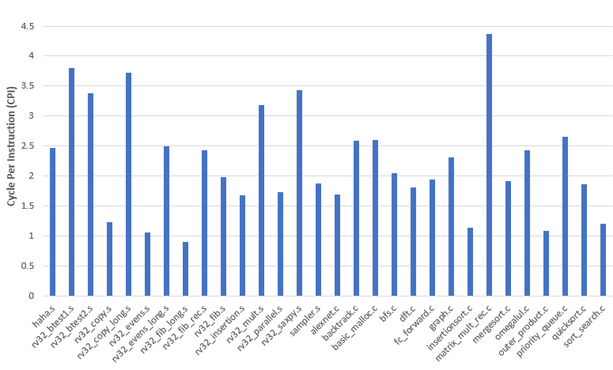

## Overview


The project has built a P6-structure pipeline to handle RISC-V instructions. Some advanced
features such as superscalar execution are added to enhance processor performance. This report
covers the design details of our project, the final implementation and testing results, and evaluation
and analysis of performance for different optional features. Here is the [report](./report.pdf) and [slides](./slide.pdf)

## Run instruction

```
make assembly   # to generate instructions
make            # to run the code
```
Or
```
make assembly   # to generate instructions
make syn        # to make synthesis
```

Run test script

```
sh test.sh test     # to test simulation
sh test.sh syn      # to test synthsis
```

## Final Performance


* Synthesized clock period: 11ns
* Average CPI: 2.23
* #total cycles / #total instructions: 1.44


## Pipeline performance compared with peer
